# Tarea 6. Fork y pull request

## Pascual Barrer Ferrer

## Enlace al repositorio

https://github.com/cifpfbmoll/hello-world-group

## Enlace al vídeo

https://youtu.be/f5qvisJ6S0M

# TODO Poner el enlace

## Introducción

En esta práctica repetiremos los pasos de la tarea 5 pero cambiando el modo en el que colaboramos con el repositorio remoto. En el anterior ejercicio clonamos los repositorios en local directamente desde el remoto original. En esta ocasión, lo que haremos será un *fork* a nuestra cuenta de GitHub y lo clonaremos en local. Nunca subiremos cambios al repositorio original directamente, sólo mediante *pull requests*.

## Haciendo el *fork*

Para comenzar nos dirigimos al repositorio original con el que queremos colaborar. En la parte superior derecha de la pantalla vemos tres botones como los de la imagen:

Pulsando sobre el que dice *Fork* empezaremos el proceso homónimo. Lo primero que nos aparecerá será una ventanita como la de la siguiente captura:

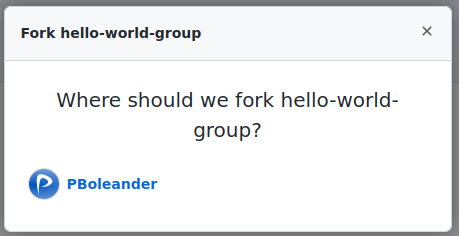

Allí elegiremos la cuenta en la que queremos hacer el *fork*. Una vez hecho esto, el proceso comienza y tarda unos segundos en completarse. Un mensaje nos lo indica. A pesar de haber un botón de actualización, en nuestro caso, no hizo falta pulsarlo ya que lo hace automáticamente al finalizar.

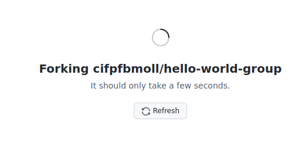

Al terminar el *fork* nos aparece el repositorio que hemos "copiado" en nuestra cuenta con un comentario indicándonos desde donde ha sido *forkeado*.

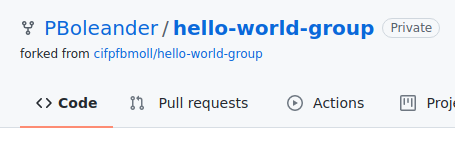

También vemos cómo el contador de *forks* ha pasado de 3 a 4.

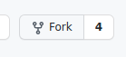

Este proyecto ahora ya es nuestro, podemos hacer y deshacer lo que queramos sin afectar en nada al repositorio original. La única manera que tendremos de modificar el original será a través de *pull requests*.

## Clonando nuestro repositorio

Ahora que ya tenemos nuestro repositorio podemos hacer un clon de él en local para trabajar más cómodamente desde nuestro ordenador y con nuestro IDE preferido. El proceso de clonado ya se ha visto repetidas veces en estas tareas y no se va a detallar demasiado. Simplemente, se mostrarán las capturas:

a) Copiamos la dirección.

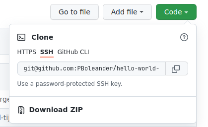

b) Y clonamos desde la terminal.

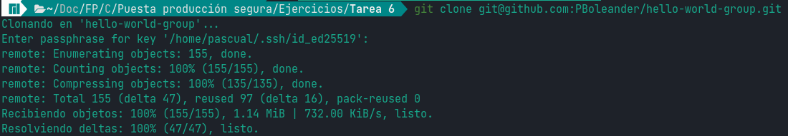

## Empieza el trabajo

Nos movemos al directorio del repositorio y modificamos algún archivo.

Por ejemplo, introducimos un comentario para saber qué hace el programa ya que uno sin ningún comentario no es muy buena práctica de trabajo. 

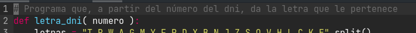

Guardamos cambios y con un `git add` y `git commit` lo registramos en `git`.

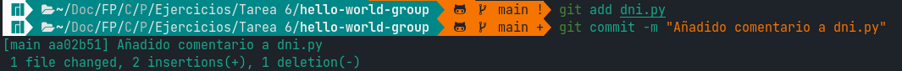

Repetimos los pasos para otros archivos (sólo se muestran las capturas para no extender demasiado la explicación).

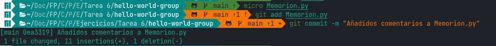

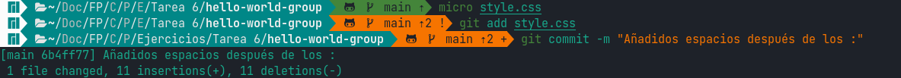

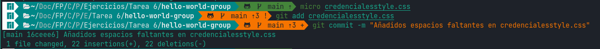

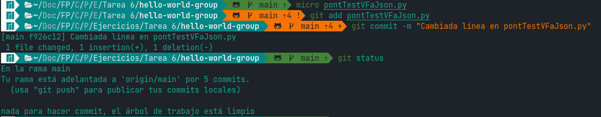

En la anterior captura vemos mediante un `git status` que ya tenemos 5 *commits* realizados, por tanto, decidimos subir nuestros cambios al repositorio remoto para, desde allí, hacer un *pull request* al repositorio original.

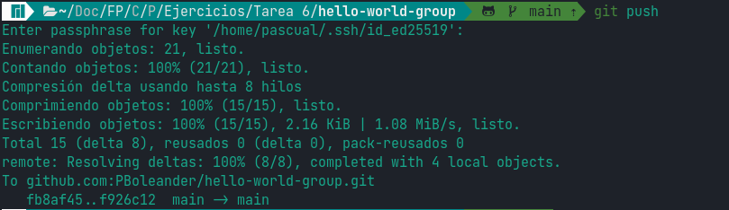

## Hacemos el *pull request*

Creamos el *pull request* desde la pestaña para tal efecto como ya hicimos en las anteriores prácticas.

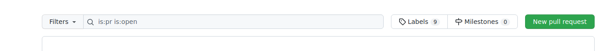

Vemos que no hay conflictos para unir los dos repositorios.

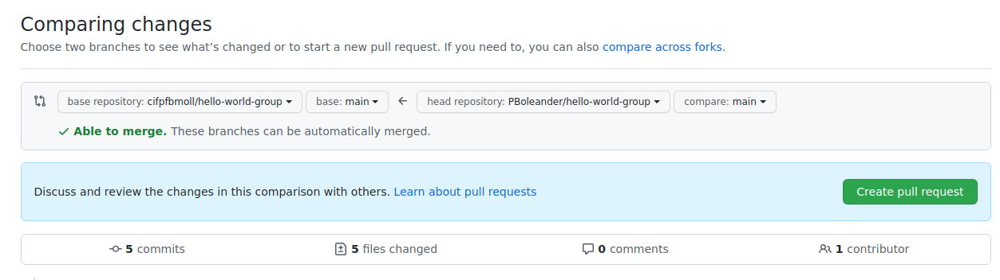

Repasamos que los cambios realizados son todos los que queríamos hacer y no se nos ha quedado ninguno en el tintero...

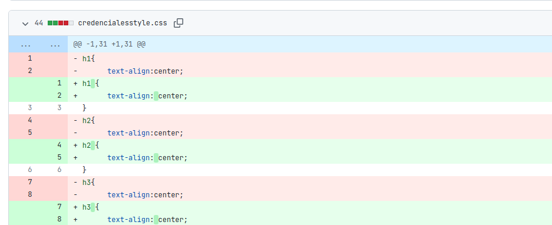

... y añadimos un mensaje y explicación de todo lo que hemos hecho para que el revisor tenga claro todo lo que se va a encontrar antes de mirar los cambios uno por uno. Damos a *Create pull request* y...

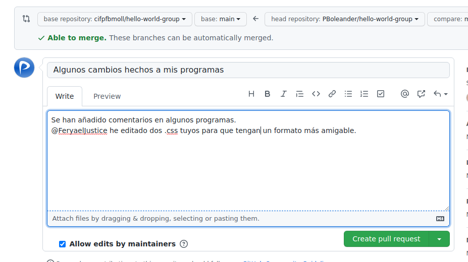

... ¡listo! Nuestro *pull request* ya está en el repositorio original a la espera de revisión por parte de los encargados de mantener ese proyecto.

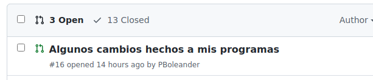

Si hay suerte se aceptará tal cual está; si no hay tanta, los cambios a hacer serán menores y si, por el contrario, los cambios son rechazados, se tendrán que hacer mejor la próxima vez.

## Revisamos un *pull request*

Vayamos ahora a mirar qué *pull requests* (PR) tenemos para revisar. Para ello nos dirigimos a la pestaña homónima y observamos que hay dos PR todavía abiertos. Elegimos uno.

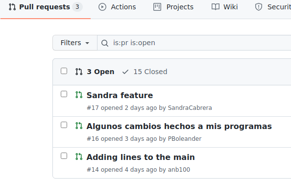

En él vemos que contiene cinco *commits* con su respectivo mensaje que nos aclara qué aportan al proyecto. Un aspecto importante a destacar de esta pantalla es que nos informa de si la fusión de la rama con `main` se puede realizar limpiamente (sin conflictos que resolver). Si clicamos en la pestaña de *Files changed* podremos ver qué archivos han cambiado, tanto modificaciones como creaciones/deleciones.

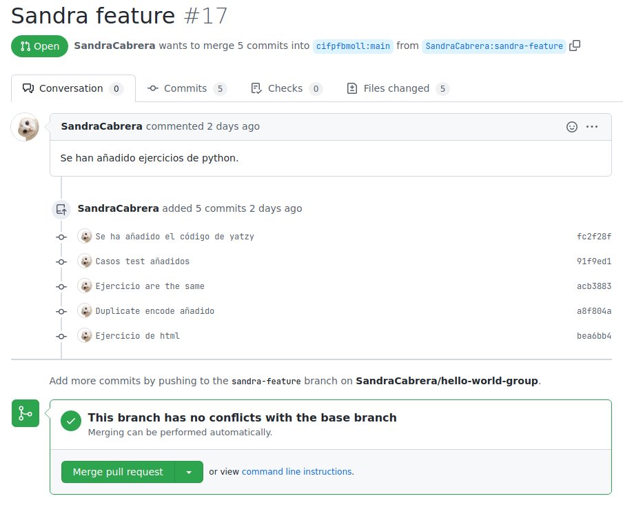

En la pestaña de archivos modificados vemos todos los archivos que se han cambiado, las líneas añadidas y las eliminadas. Así, el revisor tiene una visión de todo lo que se ha hecho y puede decidir qué hacer con el *pull request*. En resumen, tenemos 405 líneas añadidas y ninguna eliminada.

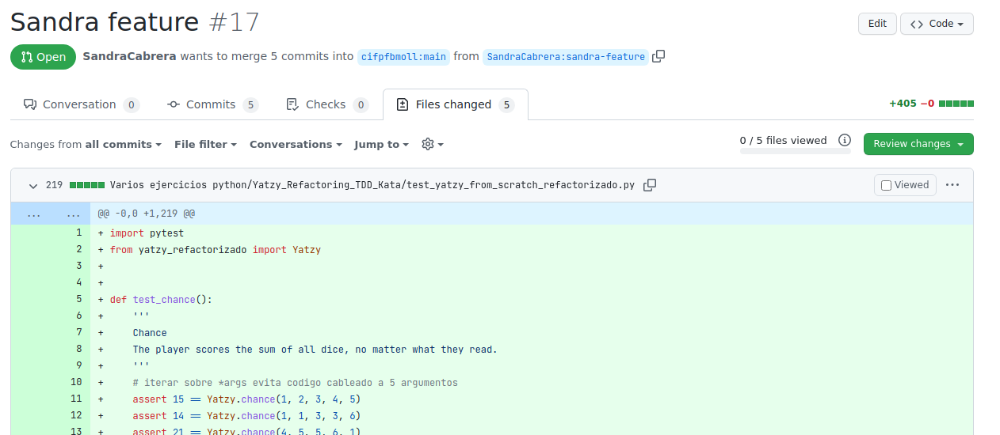

Si hacemos clic en el botón verde *Review changes* nos aparece una ventanita en la que podemos comentar los cambios, aprobarlos o pedir cambios antes de que sean aceptados. En este caso, como que todos los cambios son acertados y no presentan ningún conflicto con el código que ya estaba presente en la rama `main`, se decide aprobar los cambios. Clicamos a *Submit review* para hacerlo efectivo.

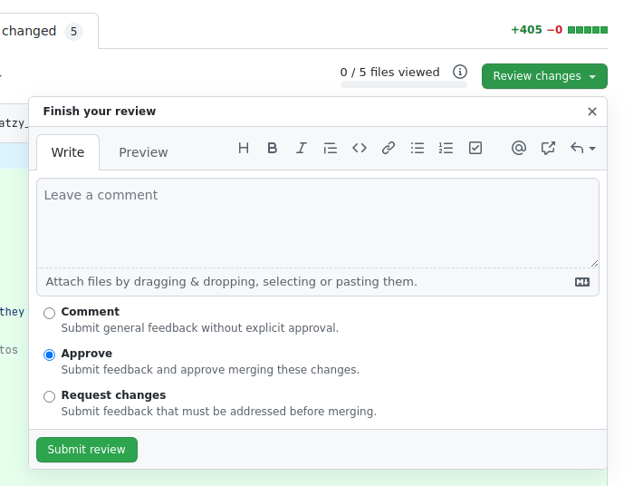

Nos sale la siguiente pantalla.

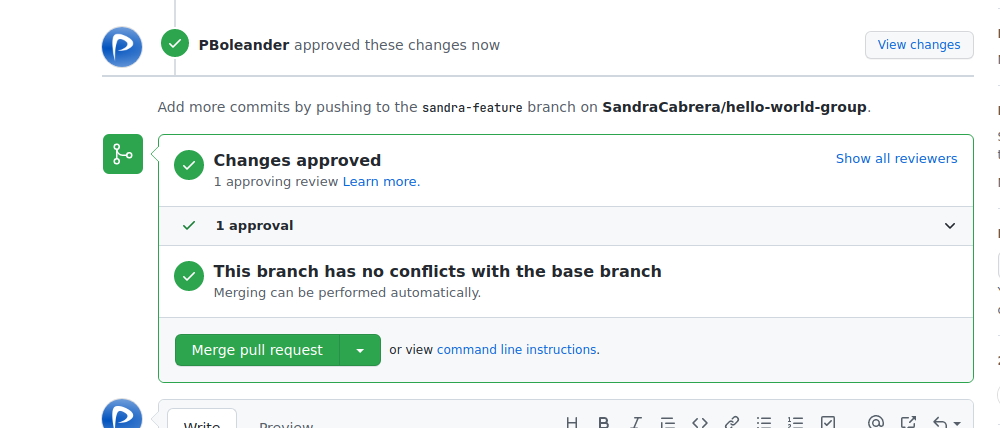

Damos clic en el botón verde *Merge pull request* para unir las ramas. Se nos pedirá una confirmación de seguridad y clicamos en *Confirm merge*.

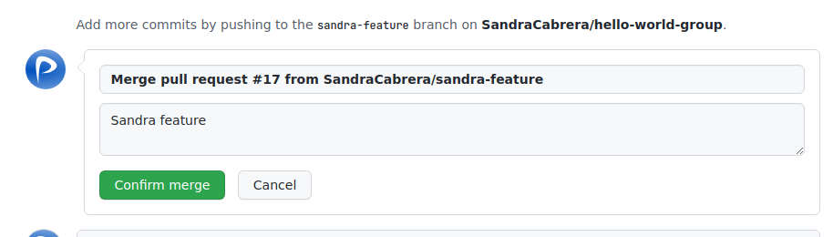

Y ¡listo! Las ramas se han fusionado y los cambios han pasado a producción.

